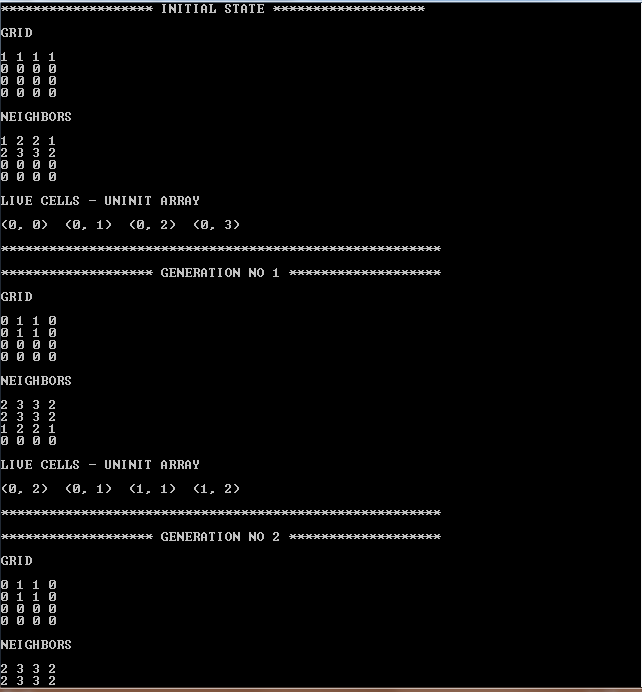

# Game of Life in C++

## Introduction

This is an implementation of John Conway's Game of Life in C++. The Game of Life is a cellular automaton simulation where cells can be in either of two states: alive or dead. The state of each cell is determined by the state of its neighbors in the previous generation.

## Requirements
- A C++ compiler (e.g. GCC)

## Installation
- ### Clone the repository:
   git clone https://github.com/Anas1108/Game_of_Life
- ### Compile the source code:
   g++ -o GameOfLife main.cpp

## Usage
### Run the compiled binary:
./GameOfLife

## Input
- The program takes the size of the grid and the initial state of the cells as input.

## Output
- The program outputs the grid after each iteration, showing the state of the cells.

## Note
- The program uses an ASCII art representation of the grid, with 'X' representing a live cell and '-' representing a dead cell.
- The program runs until the grid reaches a steady state or the maximum number of iterations has been reached.

## Contributing
Feel free to contribute to this project by creating pull requests or reporting bugs.

## License
This project is licensed under the MIT License.
